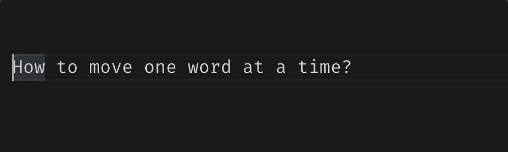

# 🚀🚀🚀 vscode-pro-tips
Use Visual Studio Code like a Pro

# 🚅 Moving around

| Purpose | Keystrokes | Illustration |
| --- | --- | --- |
| Move line up/down | ⌥ ⇡ ⌥ ⇣ |  |
| Move selected line(s) up/down | ⌥ ⇡   ⌥ ⇣ |  |
| Move cursor forward/backward by a word | ⌥ ⇢   ⌥ ⇠ |  |
| Move cursor to the start/end of line | ⌘ ⇢   ⌘ ⇠|  |

# ✄ Removing
| Purpose | Keystrokes | Illustration |
| --- | --- | --- |
| cut line where cursor is, without selection | ⌘ x |  |

# 💤 Copying & Pasting
| Purpose | Keystrokes | Illustration |
| --- | --- | --- |
| copy line and paste it | ⌘ c ⌘ v |  |
| cut line and paste it | ⌘ x ⌘ v |  |
| copy line where cursor is, without selection, paste it up or down | ⌥ ⇧ ⇡   ⌥ ⇧ ⇣|  |

# 🐴🦄 Replacing
| Keystrokes | Illustration |
| --- | --- |
| ⌥ ⇢ ⌥ ⇠|  |

# Opening
| Keystrokes | Illustration |
| --- | --- |
| ⌥ ⇢ ⌥ ⇠|  |

# Debugging
| Keystrokes | Illustration |
| --- | --- |
| ⌥ ⇢ ⌥ ⇠|  |

# Tooling
| Keystrokes | Illustration |
| --- | --- |
| ⌥ ⇢ ⌥ ⇠|  |
