# 🚀🚀🚀 vscode-pro-tips
Use Visual Studio Code like a Pro

# 🚅 Moving around

| Purpose | Keystrokes | Illustration |
| --- | --- | --- |
| Move line up/down | ⌥ ⇡ ⌥ ⇣ | 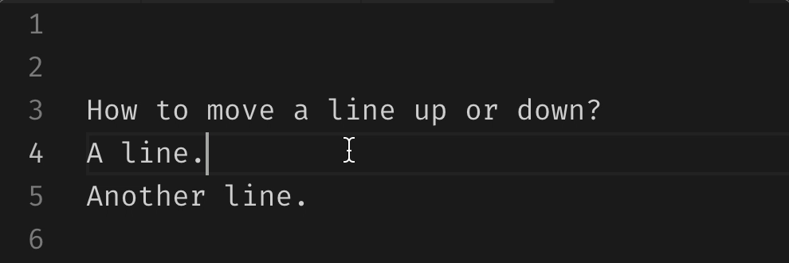 |
| Move selected line(s) up/down | ⌥ ⇡   ⌥ ⇣ | 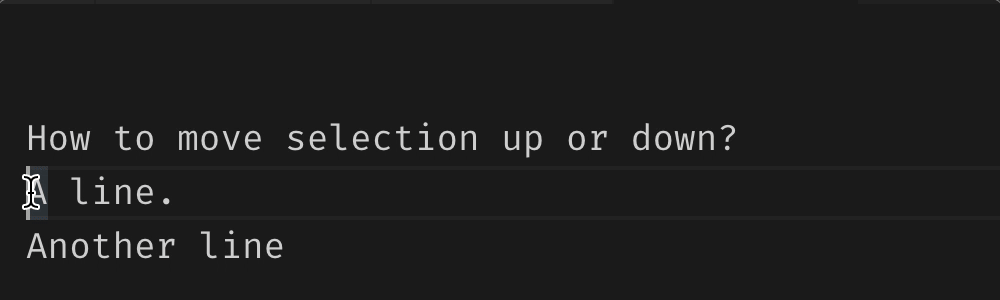 |
| Move cursor forward/backward by a word | ⌥ ⇢   ⌥ ⇠ | 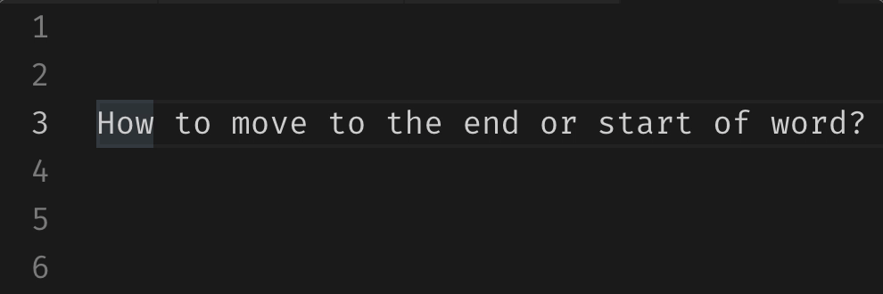 |
| Move cursor to the beginning/end of the line | ⌘ ⇢   ⌘ ⇠|  |
| Move cursor to the beginning/end of file | ⌘ ⇡   ⌘ ⇣ | 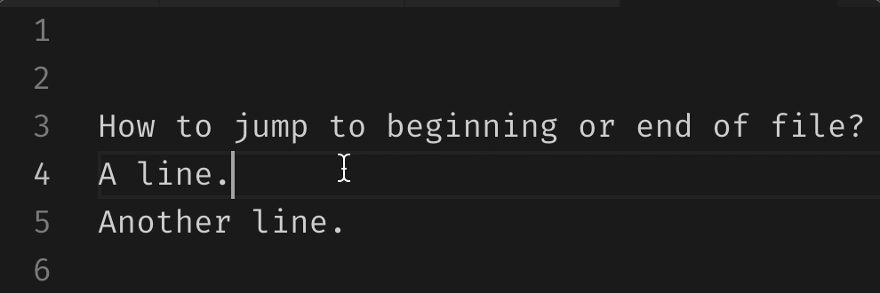 |
| Indent/outdent selection | ⌘ ]   ⌘ [ | 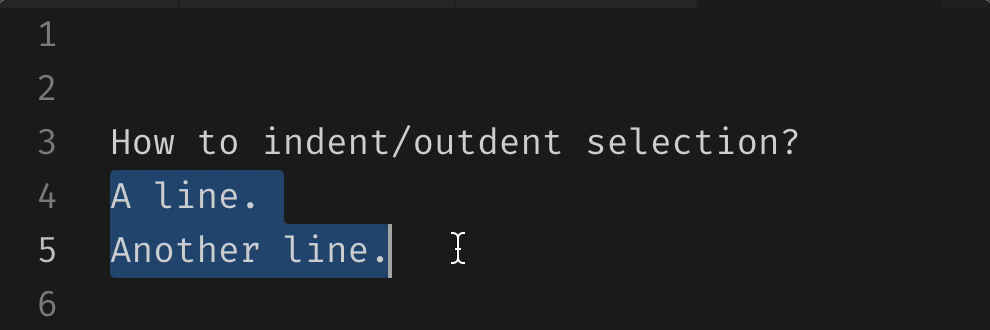 |
| Jump to a particular line number | ⌃ G | 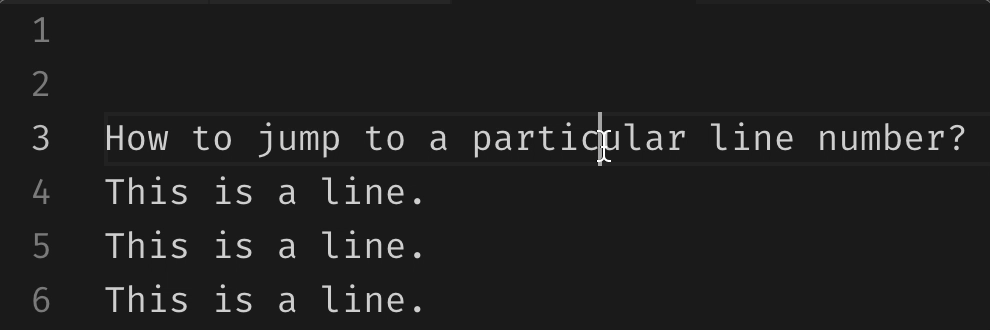 |

# ⎀ Inserting
| Purpose | Keystrokes | Illustration |
| --- | --- | --- |
| Insert a new line (above or below) and move cursor on it | ⌘ ⏎   ⌘ ⇧ ⏎ | 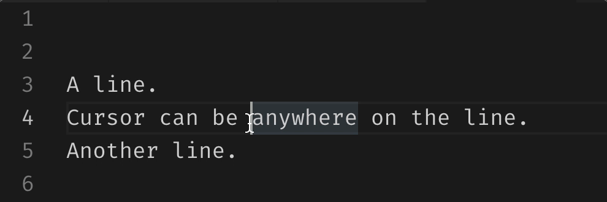 |

# ✄ Removing
| Purpose | Keystrokes | Illustration |
| --- | --- | --- |
| cut line where cursor is, without selection. Cut line is available for pasting. | ⌘ X |  |
 Remove line where cursor is, without selection. Cut line is not available for pasting. | ⌘ ⇧ K | 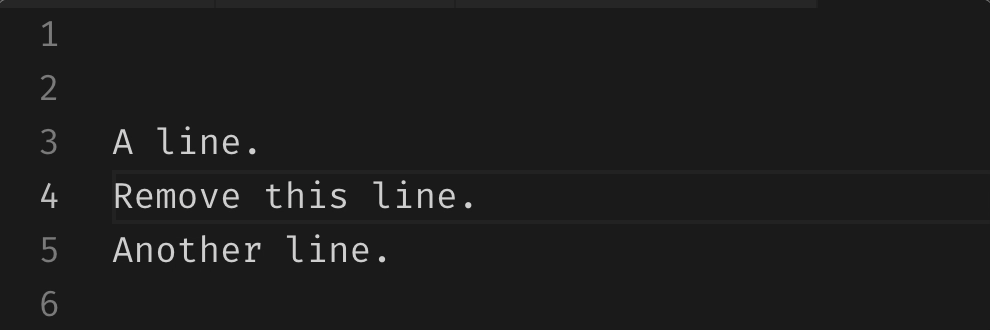 |

# 💤 Copy & Pasting
| Purpose | Keystrokes | Illustration |
| --- | --- | --- |
| copy line and paste it | ⌘ C ⌘ V | 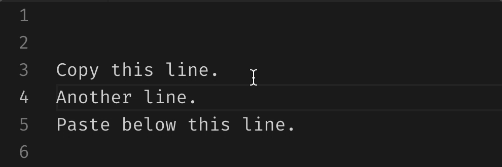 |
| cut line and paste it | ⌘ X ⌘ V | 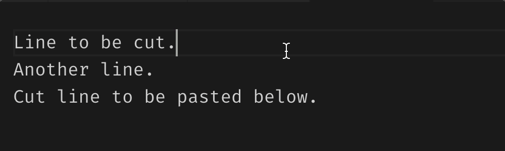 |
| copy line where cursor is, without selection, paste it up or down | ⌥ ⇧ ⇡   ⌥ ⇧ ⇣ | 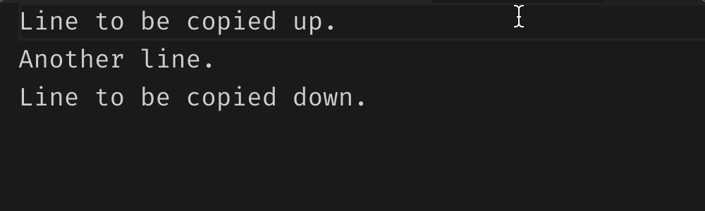 |

# 🐴🦄 Replacing
| Purpose | Keystrokes | Illustration |
| Select occurences of selected text or the word where cursor is, then delete and type or paste to replace | ⌘ D | 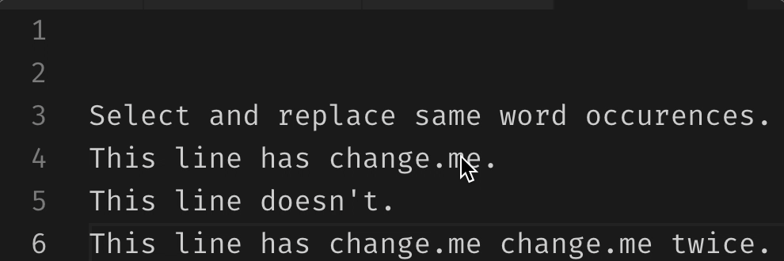 |
| Select **all** occurences of selected text or the word where cursor is, then delete and type or paste to replace | ⌘ ⇧ L | 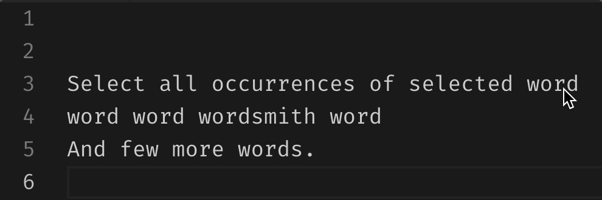 |

# Opening
| Purpose | Keystrokes | Illustration |
| --- | --- | --- |

# Debugging
| Purpose | Keystrokes | Illustration |
| --- | --- | --- |

# Tooling
| Purpose | Keystrokes | Illustration |
| --- | --- | --- |